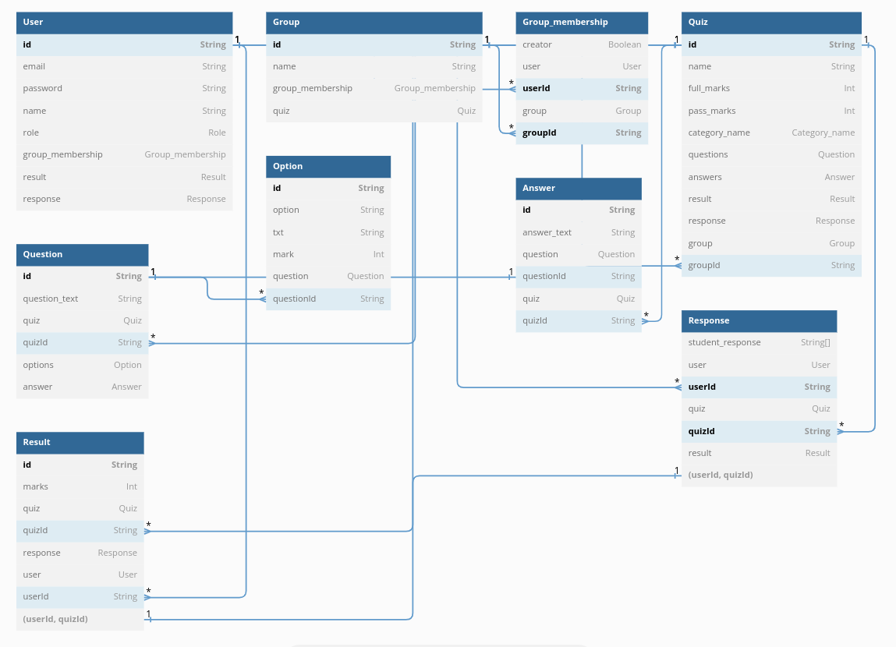

# Student Evaluation System

An online student evaluation system

## Features:

- User registration and login:  Allows users to create an account and access the quizzes.

- Group creation and management: Allows teachers to create and manage groups, invite students.

- Quiz creation and management: Allows educators or quiz creators to create and manage quizzes, including adding questions and answers, and setting time limits.

- Quiz categories: Allows users to browse  by category such as: Achievement Test, Personality Test, Psychological.

- Quiz taking: Allows users to take quizzes, view their results.Besides, we can assign marks to each option other than the correct option is to use a multiple choice or multiple selection question format, and then assign different point values to each option

## Technology Stack:

- Node js
- Express Js
- PostgreSQL
- Prisma

## Entity Relationship Diagram:




## Usage

"/.env" update the values/settings to your own

## Install Dependencies

```
npm install
```

## Run App

```
# Run in dev mode
npm start

```